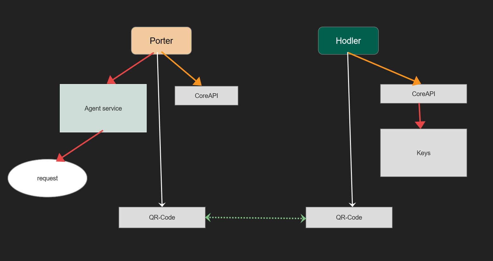
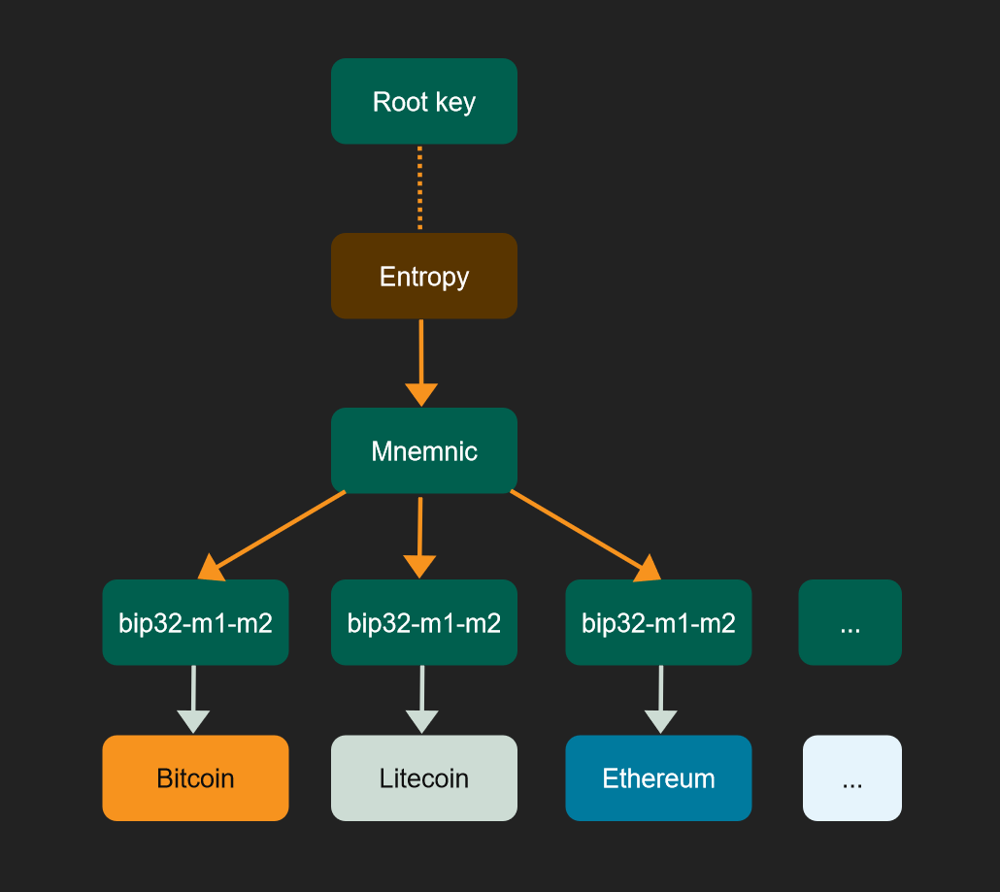

# Hodler-Wallet


## What is Hodler-Wallet ?


Hodler-Wallet is an open source cryptocurrency wallet written for Hodler.

Hodler-Wallet is composed of offline-application (Hodler) and online-application (Porter).

Types currently supported by Hodler-Wallet 0.1.0:
- Bitcoin
- Litecoin
- Bitcoin Cash
- Bitcoin SV
- Ethereum
- Ripple

Supported platforms:
- Windows
- Macos
- Linux (Ubuntu)
- Android
- iOS (Need to manually compile and install)

## Table of Contents

- [Hodler](#Hodler)
- [Porter](#Porter)
- [Install](#install)
  - [Install prebuilt packages](#install-prebuilt-packages)
  - [Build from Source](#build-from-source)
    - [Install Go](#install-go)
    - [Install Qt](#install-qt)
    - [Download and Compile](#download-and-compile)
    - [Troubleshooting](#troubleshooting)
- [Getting Started](#getting-started)
  - [Some things to try](#some-things-to-try)
- [Development](#development)
  - [Architecture Diagram](#Architecture-Diagram)
- [Donation](#donation)
- [License](#license)

## Hodler


Hodler is an offline wallet application. For key security, it should be run on devices without WiFi / Bluetooth and Internet.

Hodler uses the root key to generate private keys and addresses for various cryptocurrencies.

Hodler receives and transmits crypto currency by communicating with the Porter application, and by using the camera to scan the QR code, Hodler and the Porter application communicate.


## Porter


Porter is an auxiliary tool used by Hodler. It can exchange information with the Hodler application and assist in the transmission of crypot currency addresses and crypto currency transactions.

Porter itself does not store any key, only store the address and transaction content, and send the transaction by calling the blockchain-related service interface on the network.

The main function of Porter is to generate transactions from addresses, and then pass unsigned transactions to the Hodler application through QR codes. Hodler uses the corresponding private key to sign the transaction, and then also passes the signed transaction to Porter through the QR code. Finally Porter broadcasts the signed transaction to the blockchain to complete the transaction.


## install
### Install prebuilt packages

We host prebuilt binaries over at our [distributions page](https://github.com/yancaitech/hodler-wallet/releases/tag/0.1.0).

From there:
- Click the blue "Download Hodler / Porter" on the right side of the page.
- Desktop version Open/extract the archive.
- Android version install the .apk file.


#### Linux package
```sh
$ sudo dpkg -i porter-0.1.0.deb
$ sudo dpkg -i hodler-0.1.0.deb
```

### Build from Source

Hodler-Wallet's build system requires Go 1.14 and some standard build tools:

* Qt 5.12.8
* Go 1.14.2
* gomobile
* Git
* GCC (or some other go compatible C Compiler) (optional)
* VS 2017 C++
* XCode 
* Android SDK


#### Install Go

The build process for Hodler-Wallet requires Go 1.14.2 or higher. If you don't have it: [Download Go 1.14+](https://golang.org/dl/).

You'll need to add Go's bin directories to your `$PATH` environment variable e.g., by adding these lines to your `/etc/profile` (for a system-wide installation) or `$HOME/.profile`:

```sh
export PATH=$PATH:/usr/local/go/bin
export PATH=$PATH:$GOPATH/bin
```

(If you run into trouble, see the [Go install instructions](https://golang.org/doc/install)).


Hodler-Wallet requires gomobile, If you don't have it: [Go mobile](https://github.com/golang/mobile)


Compile mobile rpc library:
```sh
go get -u github.com/yancaitech/go-hodler-rpc

cd go-hodler-rpc/coinsrpc
gomobile init
gomobile bind -target=android
gomobile bind -target=ios
```
Replace to
* hodler-wallet\hodler\android\libs\coinsrpc.aar
* hodler-wallet\porter\android\libs\coinsrpc.aar
* hodler-wallet\hodler\ios\Coinsrpc.framework


Compile desktop rpc library:
```sh
cd go-hodler-rpc
go build main.go
```

Replace to
* \hodler-wallet\hodler\win\coinsrpc
* \hodler-wallet\hodler\linux\coinsrpc
* \hodler-wallet\hodler\macos\coinsrpc

#### Install Qt
The build process for Hodler-Wallet requires Qt 5.12.8. If you don't have it: [Download Qt 5.12.8](https://download.qt.io/archive/qt/5.12/5.12.8/)

If you use macos platform, you need to download XCode.
Windows platform, need to download VS 2017.

To compile apk for android platform, you need to download Android SDK.

#### Download and Compile
```sh
$ git clone https://github.com/yancaitech/hodler-wallet
```

Use Qt Creator to open the project file 
* /hodler-wallet/hodler/hodler.pro
* /hodler-wallet/porter/porter.pro

and select the corresponding platform to compile.


#### Troubleshooting
- Some platforms may require manual configuration of OpenSSL

## Getting Started

See also: https://github.com/yancaitech/hodler-wallet/doc

### Some things to try
- Use two devices to run Hodler and Porter
- Hodler initializes the root key
- Receive bitcoin, transfer it from other websites to the bitcoin address displayed by Hodler
- Send bitcoin, use Porter to scan the QR code of the bitcoin address displayed by Hodler
- Use "Create transaction", then use Hodler to scan the QR code and sign the transaction
- Use Porter to scan the signed transaction QR code and send it to the blockchain network

## Development

Some development dependencies:
- Hodler rpc: [go-hodler-rpc](https://github.com/yancaitech/go-hodler-rpc)
- Hodler keys: [go-hodler-keys](https://github.com/yancaitech/go-hodler-keys)
- Hodler utils: [go-utils](https://github.com/yancaitech/go-utils)

### Architecture Diagram

#### Map of Hodler-Wallet Subsystems


Description: Hodler manages the keys and addresses, and signs the transactions passed by Porter. Porter generates transactions and broadcasts the signed transactions passed by Porter to the blockchain network.

#### Hodler Key Architecture


Description: The root key is a 256-bit number, managed by mnemonic words, and each subkey is divided by bip32's m1 and m2.

## Donation
The donation to this project will be used for development, maintenance, and deployment of blockchain service nodes.

bitcoin:
- 1HoDLerRSWcYv8J9GVyscqrRyW8WWGczsR


litecoin:
- LSPqfuL6N9gVGWJk28xHrNhaGAM3Jjkj9M

bitcoincash:
- qz8t3ce2wpgd3qdw7dkv0w7gdf83jnsmzu4mcm83ea

ethereum:
- 0x61ef9781aa572f73321f7afbf7c5c8897e4fa9fb

ripple:
- rDi3LBiM7UTcDtx9wnPXf83k4BuX7KUy6o

## License
The Hodler-Wallet project is under GNU GENERAL PUBLIC LICENSE version 3:
- GNU GENERAL PUBLIC LICENSE ([GPLv3](https://github.com/yancaitech/LICENSE.GPLv3))

Copyright © 2020 yancaitech <yancaitech@gmail.com>